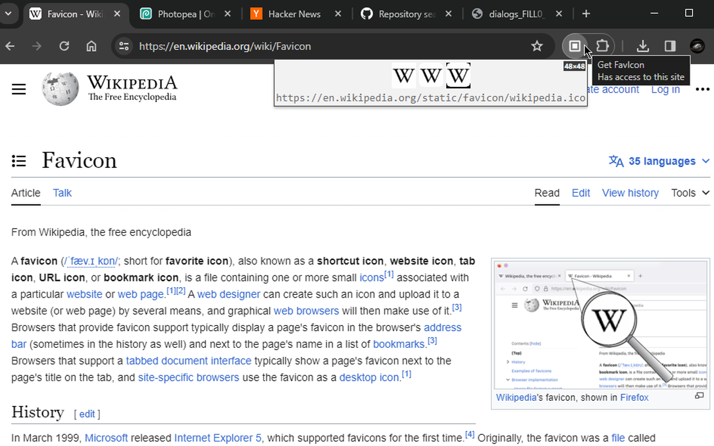

# Get FavIcon
Get FavIcon of current tab.

# Overview
Clicking the extension icon will open a popup window showing the FavIcon for the current tab, along with a preview of the icon on white/transparent/black background, it's original size, and a link to it.

NOTE: it will show "unknown" if no FavIcon is found (as is the case for special pages, or opened image files for example).

REPO: https://github.com/azrafe7/get-favicon
 
ISSUES: https://github.com/azrafe7/get-favicon/issues
 